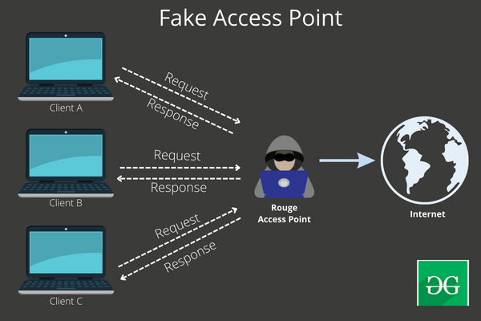
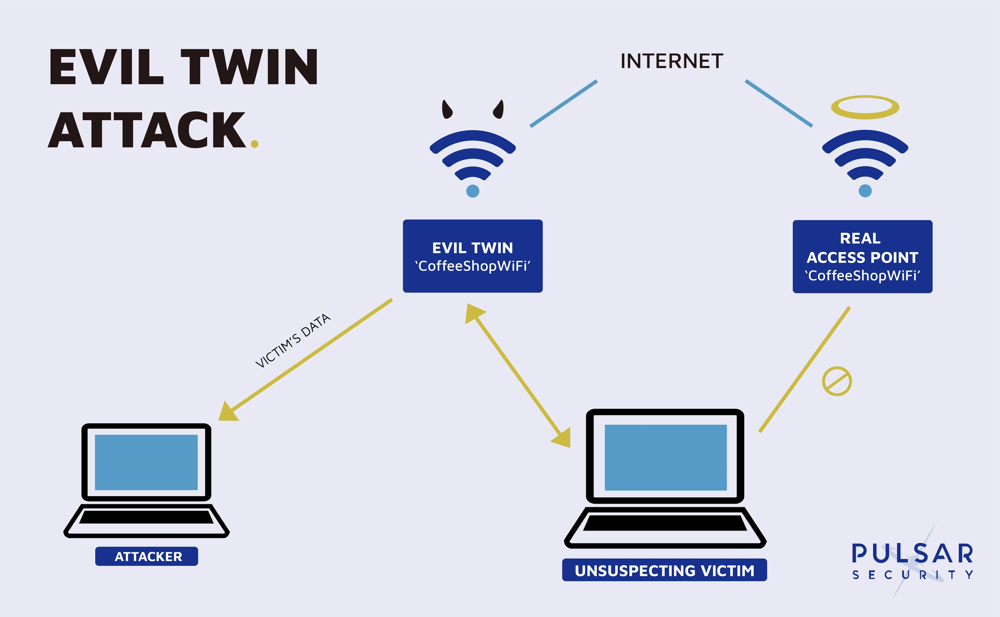
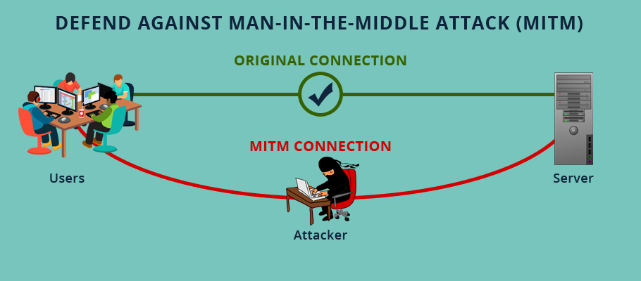

# don't use free wifi

Now anywhere such as (university, cafe, mall, restaurant, or many others)

So he asked the first question: Is there Wi-Fi here?
 I would like to tell you my friend, if yes, and of course you are happy and you go online, then this could be the worst decision you have ever made in your life. I will not explain how to connect to the access point because it is not our place, but I will tell you what is possible.

## Count on me, there are still a series of attacks that could happen.

(1): **WiFi phishing (AP)**: This means that the hacker creates a fake network with the same network name (ssid) and turns out to be a trusted network, then carries out an authentication attack, which in turn cuts off the connection. Turns off the Internet for users on the original network and allows them to connect to the network. Fake, this can leave the attacker with great potential to steal data through other methods that we will not talk about now.

(2): **Evil Twin Attack**:The same scenario above can happen if an attacker wants to steal the network password through an attack called Evil Twin Attack. This does exactly the same thing as above, but the difference is that it leads to a fake Wi-Fi login page where the person enters the network password and connects to the facility.

(3): The most dangerous because he is ***(man in the middle attack (MitM))***. In this attack, the attacker makes his device act as if it were an access point. This makes him stand in the middle between you and the access point, and is able to see all the traffic. Anyone accessing their laptop from your device can then pull up important data such as cookies, and it will in turn save your login information in order to open a site like Facebook or Instagram for example, or it can pull up important passwords if you On http protocol.

Well, Mahmoud, we talked about attacks, but they could cause us disaster if, for example, bank data or digital currencies are stolen.

## what should we do?
I'll tell you, my friend, what to do, even though it's not safe either, but if I have to.

(1) You will connect to a VPN before using any network in a public place.

(2) Make sure that any website you visit begins with (https).

(3) Do anything important, such as the bank’s website or other important data.

(4) Do not step on anything you do not know, and do not download anything. My advice is if you're really afraid, if you enter a password, change it when you get the chance.
We shouldn't talk about all this my friend. In short, do not use the Internet for free
### summery
There are many things that an attacker can exploit if you are on the same network, and this is not necessarily a danger to you, but it may be a danger to the company you work for or your home and family.